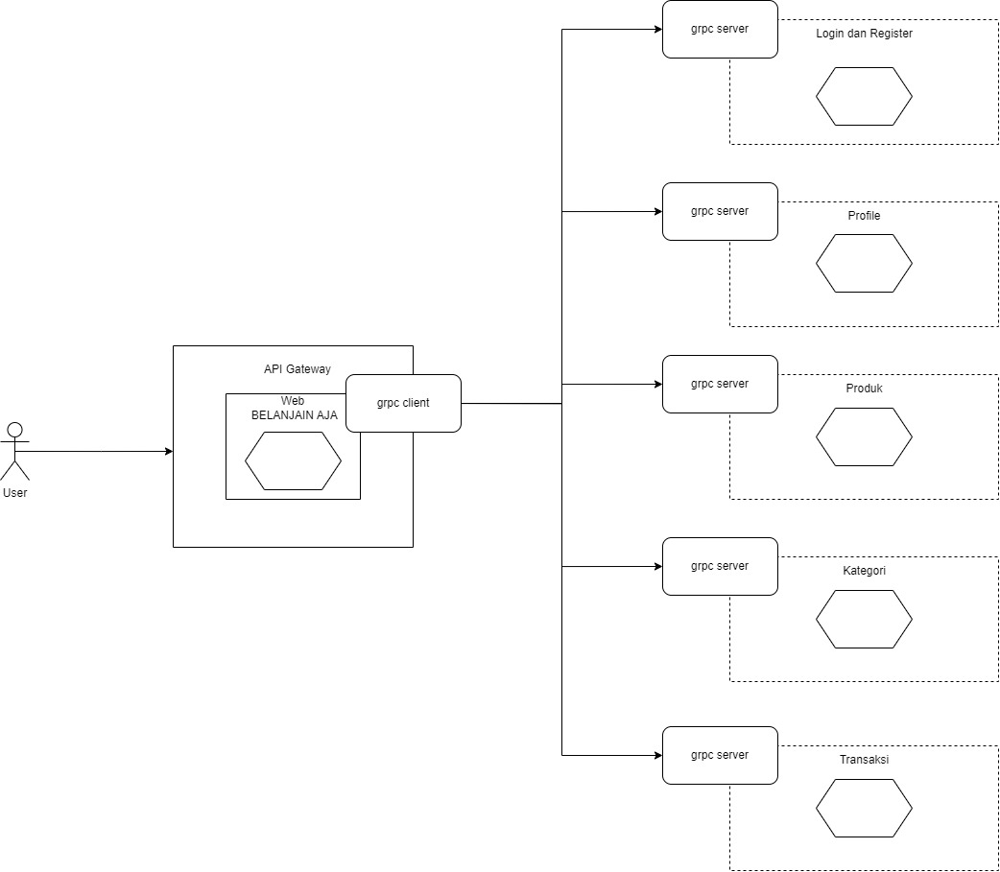
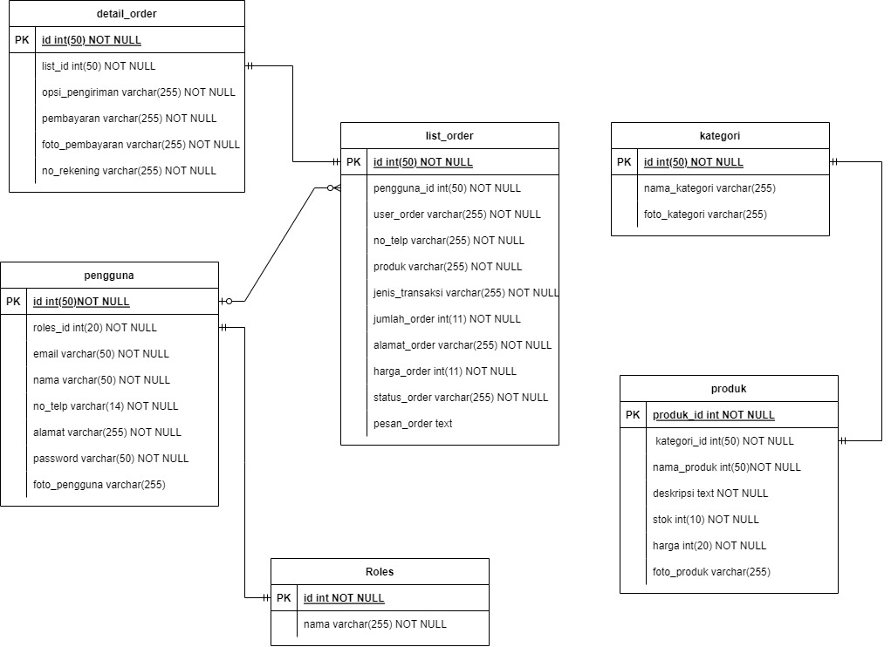
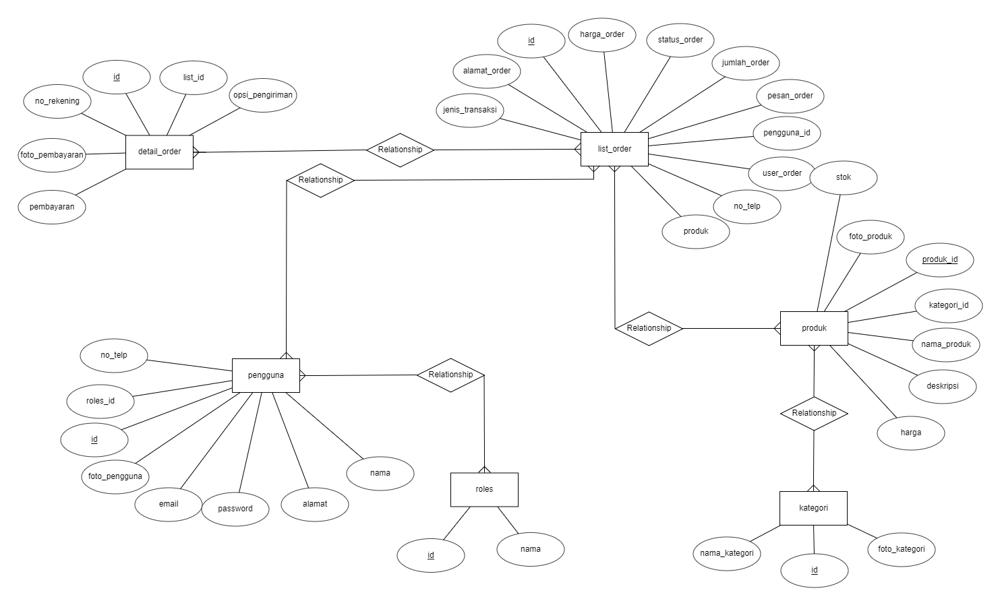

# BELANJAIN AJA

Aplikasi "Belanjain Aja" adalah platform belanja online yang menyediakan fitur-fitur unggul dalam pengelolaan pengguna, produk, kategori, transaksi, autentikasi, dan pembaruan profil pengguna. Dengan desain yang ramah pengguna, aplikasi ini memudahkan pengguna untuk menjelajahi dan melakukan transaksi belanja secara efisien.

## ANGGOTA

- Elgania Aulia Gemintang		120140113
- Emirsyah Putra			    120140169
- Fitra Ilyasa				120140048
- M Haikal Fauzananda 		120140168
- Syafira Wulandari 			120140142

## FITUR

- Kelola User Belanjain Aja:
Sistem manajemen pengguna Belanjain Aja yang efisien, termasuk pendaftaran dan manajemen akun Belanjain Aja.
- Kelola Produk Belanjain Aja:
Penyajian produk Belanjain Aja dengan tampilan yang menarik dan informatif.
Pengelolaan stok dan informasi produk Belanjain Aja yang mudah diakses oleh pemilik toko Belanjain Aja.
- Kelola Kategori Belanjain Aja:
Kategori produk Belanjain Aja yang terorganisir dengan baik untuk mempermudah pencarian.
Penambahan dan pengelolaan kategori produk baru Belanjain Aja dengan cepat.
- Kelola Transaksi Belanjain Aja:
Transaksi Belanjain Aja secara real-time untuk pemantauan bisnis yang efektif.
Konfirmasi Transaksi kepada pengguna dan pemilik toko.
- Autentikasi Belanjain Aja:
Sistem keamanan login yang kuat untuk melindungi akun pengguna Belanjain Aja.
- Update Profile User Belanjain Aja:
Kemudahan pengguna dalam memperbarui informasi profil pengguna Belanjain Aja.

## ARSITEKTUR

## CLASS DIAGRAM

## ERD
